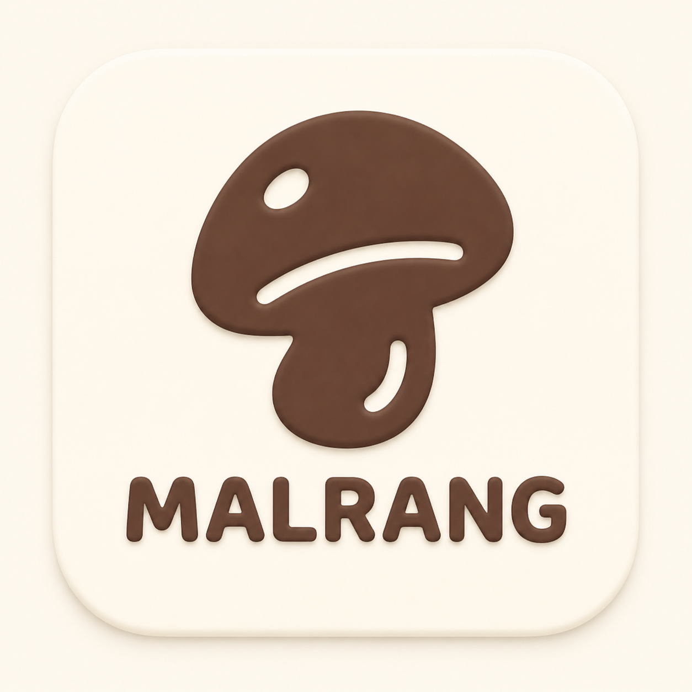

  

<h1 align="center">말랑키 (MalangKey)</h1>

  <b>귀엽고 감각적인 디자인의 오프라인 안드로이드 오픈소스 키보드</b>

---

## 🌟 말랑키(MalangKey)의 특별한 장점

말랑키는 사용자에게 **편안하고 즐거운 타이핑 경험**을 제공하기 위해 설계된 커스텀 안드로이드 키보드입니다. 기존의 딱딱한 키보드에서 벗어나, 아래와 같은 강력한 장점들을 제공합니다.

### 1. 귀엽고 감각적인 디자인 🎨
단순하고 칙칙한 키보드는 이제 그만! 말랑키는 부드럽고 말랑말랑한 테마와 디자인 요소를 제공합니다. 사용자의 기분과 취향에 맞춰 언제든지 예쁜 키보드를 사용할 수 있습니다.

### 2. 완벽한 개인정보 보호 🔒
말랑키는 프라이버시를 최우선으로 생각합니다. 완전히 오프라인 상태에서 동작하며, 사용자의 타이핑 데이터나 개인정보를 외부 서버로 절대 전송하지 않습니다. 안심하고 입력하세요.

### 3. 강력한 커스터마이징 🛠️
사용자의 편의에 맞춰 키보드의 거의 모든 것을 변경할 수 있습니다. 
- 색상 및 테마 커스텀
- 폰트 스타일 변경
- 키보드 높이 조절
- 기능 키 배치 수정 등

### 4. 가볍고 빠른 타이핑 경험 ⚡
무겁고 버벅이는 키보드 대신, 고도로 최적화된 코드 구조를 통해 빠르고 쾌적한 입력 속도를 제공합니다.

---

## 🚀 기여 및 라이선스
말랑키는 누구나 참여할 수 있는 오픈소스 프로젝트입니다. 개선 사항이나 버그 리포트는 언제든 환영합니다!
이 프로젝트는 Apache License 2.0에 따라 배포됩니다.
